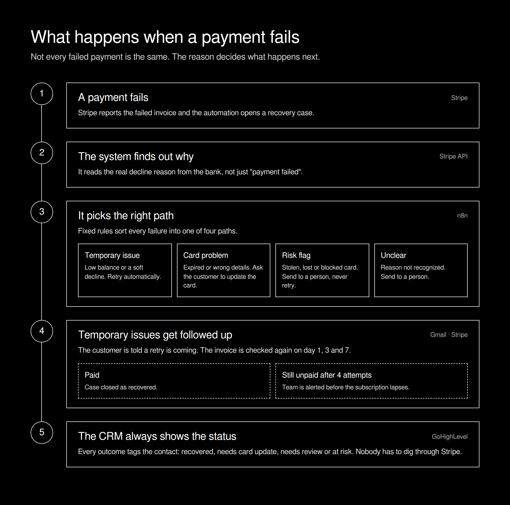
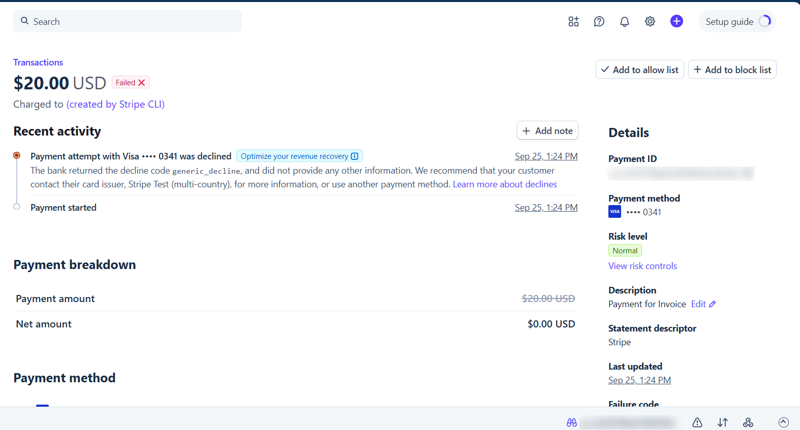
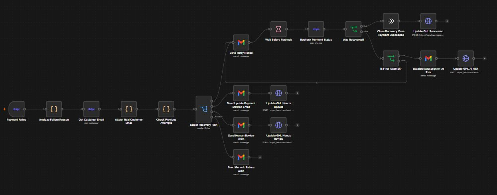
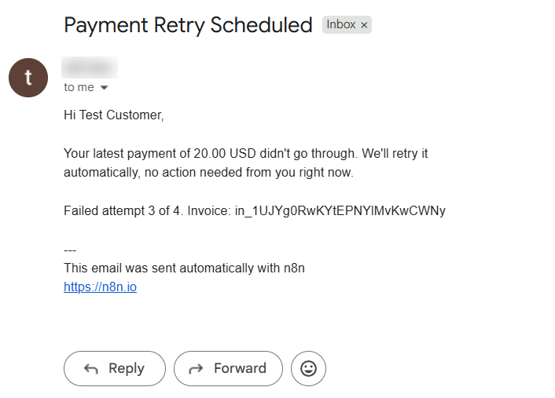
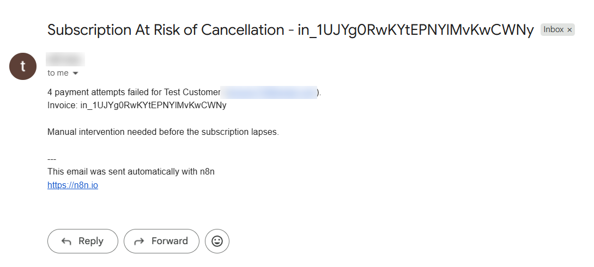
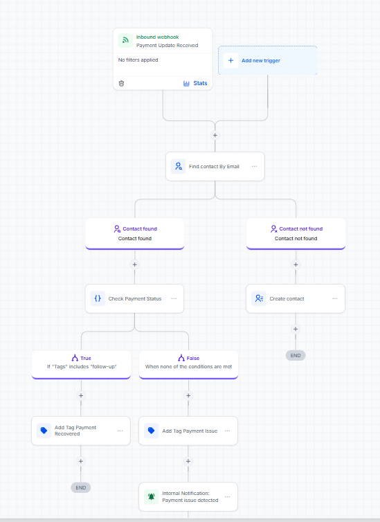
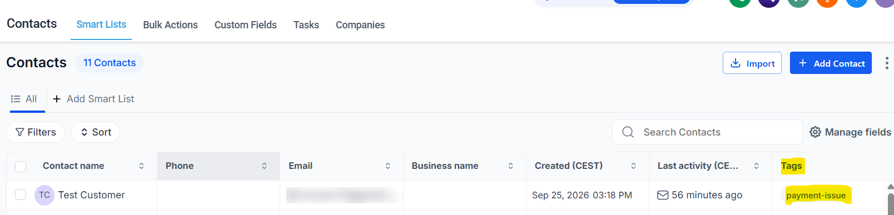
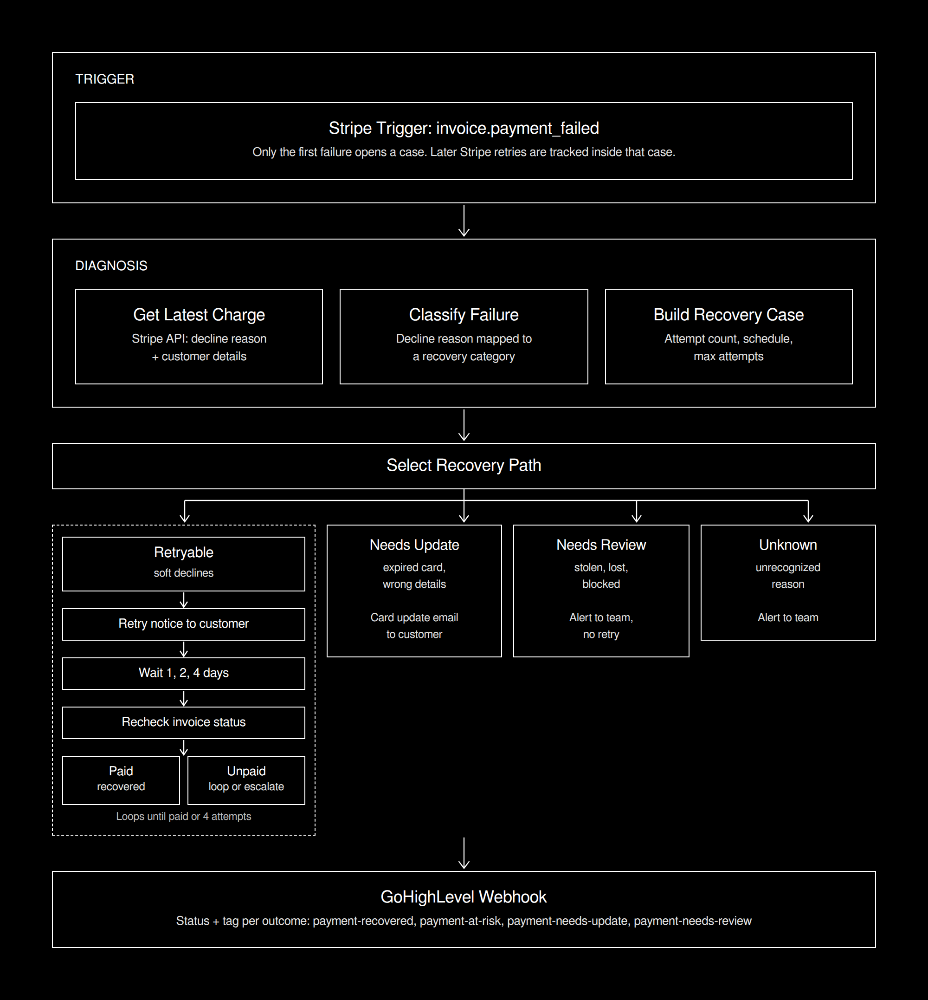

# Stripe Payment Recovery Automation

An n8n workflow that recovers failed Stripe payments by first finding out **why** a payment failed, then sending each case down the right recovery path: automatic retry follow-up, card update request, or human review. Every outcome is synced to GoHighLevel.

> **Not every failed payment is the same. The reason decides what happens next.**

Built with **n8n, Stripe, Gmail, and GoHighLevel.**



---

## The Problem

Most businesses handle failed payments one of two ways: they let Stripe retry silently, or they send the same generic "your payment failed" email to everyone.

Both miss the point, because failed payments have very different causes:

* A temporary low balance usually fixes itself on the next retry
* An expired card will fail every time until the customer updates it
* A stolen or blocked card should never be retried at all

Treating them the same means lost revenue, annoyed customers, and a team that only finds out about churn after the subscription is already gone.

---

## What This System Does

When a Stripe invoice payment fails, the workflow:

1. Opens a recovery case for the invoice
2. Pulls the real decline reason from Stripe
3. Sorts the failure into a recovery category using fixed rules
4. Runs the matching recovery path
5. Follows up on retryable failures until the invoice is paid or the attempts run out
6. Escalates to the team before a subscription lapses
7. Updates the contact in GoHighLevel with the current status

---

## How It Works

### 1. The Failure

Stripe sends an `invoice.payment_failed` event to n8n.



Stripe fires this event again on every retry. Only the first failure opens a case, later retries are tracked inside that same case, so the customer never gets duplicate emails.

### 2. The Diagnosis

The invoice event on its own only says that a payment failed. The workflow reads the decline reason from the charge and maps it to one of four categories:

| Category         | Typical reasons                     | Path                                  |
| ---------------- | ----------------------------------- | ------------------------------------- |
| **Retryable**    | Insufficient funds, soft declines   | Customer notified, invoice rechecked  |
| **Needs update** | Expired card, wrong card details    | Customer asked to update the card     |
| **Needs review** | Stolen, lost or blocked card        | Team alerted, no automatic follow-up  |
| **Unknown**      | Reason not recognized               | Team alerted                          |

### 3. The Workflow



---

## The Recovery Paths

### Retryable

The customer gets a short notice that the payment will be retried and no action is needed yet. The workflow then waits and checks the invoice status again on day 1, 3 and 7.

* **Invoice paid:** the case is closed with status `recovered`
* **Still unpaid after 4 attempts:** the team gets an escalation email and the case gets status `at_risk`





### Needs Update

The customer is asked to update their payment method. Retrying an expired card would only fail again. Status: `needs_payment_update`.

### Needs Review

Stolen, lost or blocked cards go straight to a person. An automated retry here is the wrong move. Status: `needs_manual_review`.

### Unknown

If the reason is not recognized, the workflow does not guess. The team gets an alert with the invoice details.

---

## CRM Integration

Every classified outcome (recovered, at risk, needs update, needs review) is sent to a GoHighLevel inbound webhook with its status. Unknown failures go to the team by email only.

The GoHighLevel workflow finds the contact by email (or creates it), tags it `payment-recovered` or `payment-issue`, and notifies the team when a payment needs attention. The team sees the state of every failed payment without opening Stripe.





Example payload ([`sample_ghl_payload.json`](sample_ghl_payload.json)):

```json
{
  "customerEmail": "jane.doe@example.com",
  "customerName": "Jane Doe",
  "invoiceId": "in_1Abc234DefGhi567",
  "amountDue": 4900,
  "currency": "usd",
  "attemptCount": 4,
  "failureCode": "insufficient_funds",
  "status": "at_risk",
  "tag": "payment-at-risk"
}
```

---

## Example Data

All sample files use fake data.

* [`sample_stripe_event.json`](sample_stripe_event.json): the Stripe event that starts the workflow
* [`sample_recovery_case.json`](sample_recovery_case.json): the recovery case after diagnosis
* [`sample_ghl_payload.json`](sample_ghl_payload.json): what GoHighLevel receives

---

## Architecture



---

## Design Decisions

* **Diagnose before acting.** The decline reason decides the path, not a one-size-fits-all email.
* **One case per invoice.** Stripe's own retries do not restart the process or duplicate emails.
* **Check the invoice, not assumptions.** Recovery is confirmed only when Stripe reports the invoice as paid.
* **Humans where it matters.** Risky and unclear cases go to a person instead of an automated retry.
* **CRM as the single view.** Every outcome ends up on the contact, where the team can filter and act on it.

---

## Limitations

* Retry timing on Stripe's side depends on the account's retry settings, the workflow only checks and follows up
* Decline reasons that are not in the known list fall back to human review
* Customer emails depend on the email stored in Stripe

---

## Tech Stack

| Tool            | Role                                        |
| --------------- | ------------------------------------------- |
| **n8n**         | Workflow orchestration and recovery logic   |
| **Stripe**      | Payment events, charge and invoice data     |
| **Gmail**       | Customer notices and team alerts            |
| **GoHighLevel** | Contact status and tags                     |

---

## Project Structure

```text
Stripe-Payment-Recovery-Automation/
│
├── screenshots/
│   ├── stripe_failed_invoice.png
│   ├── n8n_workflow.png
│   ├── email_retry_notice.png
│   ├── email_escalation.png
│   ├── ghl_workflow.png
│   └── ghl_contact_tags.png
│
├── payment_recovery_overview.png     # client-friendly overview
├── payment_recovery_technical.png    # technical flow
├── sample_stripe_event.json
├── sample_recovery_case.json
├── sample_ghl_payload.json
└── README.md
```

---

## About

Built as a portfolio project focused on practical revenue automation with n8n, Stripe, CRM workflows, and deterministic business logic.

**Don't let failed payments turn into silent churn.**
